##TensorFlow — Getting started, GPU installation on EC2

TensorFlow is Google’s Machine Learning cross-platform open-source framework. It offers API binding to C++, Python, Java, however the Python API is the most complete one. Though there’s definitely a lot of progress toward mobile devices as well.

It’s one of the most followed Github repositories and has a lot of momentum. Just in recent months, *skflow*, which is a higher-level wrapper of scikit-learn has joined the official repository as *tf learn*.

This post is going to be the first one in a series, to get you up and running TensorFlow in a production ready environment. Jupyter installation and extra space can allow you to have a DEV instance. Unlike other guides out-there, this one doesn’t use ‘whl’ and shows you how to install the latest versions from source and tries to be as thorough as possible.

Deep Learning, requires a lot of matrix operations (dot products, transformations, factorization, etc..) and usually involve multiple layers. All of these operations are best performed using a GPU (10X to 100X improvements)

> *hopefully in the near future google will release their TPU — TensorFlow Processing Unit, which is a special processing unit optimized for TensorFlow that will run on their cloud ← reference to this can be seen in the 0.9 configure*

A GPU (Graphical Processing Unit) is a processing unit that specialize in parallel processing. This post will guide you through the process of building an AMI (Amazon Machine Instance) for development on EC2.

The difference between a production and a development machine, is in:

* Disk size
* Installed tools
* Other configurations

Requirements:

* Instance with Nvidia GPU/ Amazon Web Services Account
* Ubuntu 14.04 OS
* 15GB+ of disk space

We’re going to install / build (at time of writing):

* CUDA 7.5
* CUDNN 5.1.3
* TensorFlow 0.9 [latest / choose your branch]
* GCC 4.9
* MiniConda (Python 3.5.2)
* Numpy, Scipy
* Jupyter notebook 
* Tensorboard

Select Ubuntu as the AMI

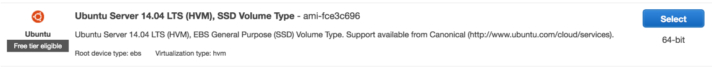

The type of instance we’ll use is the g2.2xlarge, it has a K520 Grid GPU

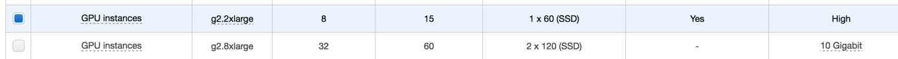

Add meaningful tags
(p1/im
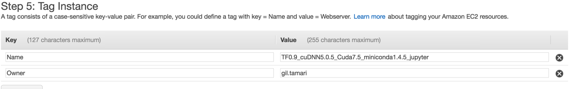

Security group, make sure you have these ports open (for TensorBoard and for Jupyter)

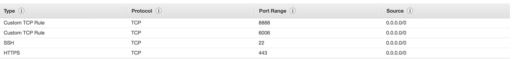

If you plan on adding training data, make sure you add an EBS SSD drive. 200GB is a reasonable amount to use

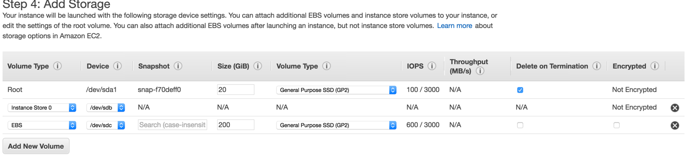

We can see the instance is running
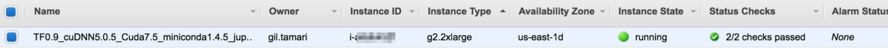

We start by updating the OS’s packages.

	sudo apt-get update && sudo apt-get -y upgrade

TF requires gcc++ 4.9

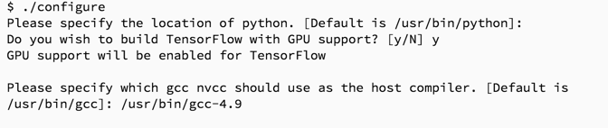

	sudo add-apt-repository ppa:ubuntu-toolchain-r/test
	sudo apt-get update
	sudo apt-get install g++-4.9
	sudo apt-get install git

Need to install Nvidia GPU driver. Always confirm (of course we know it’s part of the instance, but this is a good practice) an NVIDIA GPU exist:

	lspci | grep -i nvidia

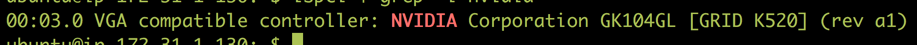

Next, let’s install CUDA 7.5 from https://developer.nvidia.com/cuda-downloads

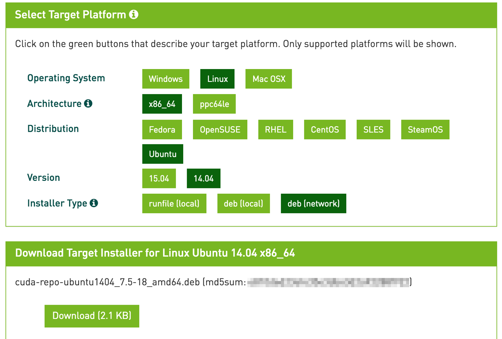

right click on the Download and run
	
	wget http://developer.download.nvidia.com/compute/cuda/repos/ubuntu1404/x86_64/cuda-repo-ubuntu1404_7.5-18_amd64.deb
	sudo dpkg -i cuda-repo-ubuntu1404_7.5-18_amd64.deb
	sudo apt-get update
	sudo apt-get install cuda

follow the instructions on site (they are listed above, just in case they change).

Afterwards edit bashrc

	vim ~/.bashrc

Add to the bottom the paths

	export CUDA_HOME=/usr/local/cuda
	export CUDA_ROOT=/usr/local/cuda
	export PATH=/usr/local/cuda-7.5/bin:$PATH
	export LD_LIBRARY_PATH=/usr/local/cuda-7.5/lib64:$LD_LIBRARY_PATH
	export PATH="$HOME/miniconda3/bin:$PATH"

verify CUDA installation by running

	sudo reboot
	nvcc --version
	
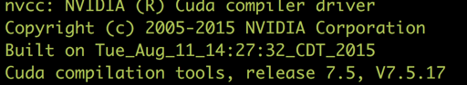

It might install an **OLDER** Nvidie display driver, so searching for nvidia installed packages:

	dpkg -l

results in:

	rc nvidia-352 352.93–0ubuntu1 amd64 NVIDIA binary driver — version 352.93

Removing previously installed Nvidia display driver (in our case nvidia 352), if exist:

	sudo apt-get remove nvidia-352 nvidia-modprobe nvidia-settings

we black list any nouveau drivers — these are free nvidia compatible drivers
which are composed of Linux kernel mode settings drivers. *linux-image-extra-virtual* are extra drivers left out of the base kernel.

	echo -e “blacklist nouveau\nblacklist lbm-nouveau\noptions nouveau modeset=0\nalias nouveau off\nalias lbm-nouveau off\n” | sudo tee /etc/modprobe.d/blacklist-nouveau.conf
	echo options nouveau modeset=0 | sudo tee -a /etc/modprobe.d/nouveau-kms.conf
	sudo update-initramfs -u
	sudo reboot
	sudo apt-get install -y linux-image-extra-virtual
	sudo reboot
	sudo apt-get update

You’re telling apt-get to reinstall the linux-headers package for the current kernel version (that’s the substitution ‘uname -r’ command)

	sudo apt-get install -y linux-source linux-headers-`uname -r`

Next, installing the driver:

	wget http://us.download.nvidia.com/XFree86/Linux-x86_64/367.27/NVIDIA-Linux-x86_64-367.27.run
	chmod +x NVIDIA-Linux-x86_64-367.27.run
	sudo ./NVIDIA-Linux-x86_64-367.27.run

Accept:

* NO to dkms
* NO to 32 lib
* NO to xconfig

Note: If you get the warning (**you shouldn’t**)

	WARNING: nvidia-installer was forced to guess the X library path ‘/usr/lib’ and X module path ‘/usr/lib/xorg/modules’; these
	 paths were not queryable from the system. If X fails to find the NVIDIA X driver module, please install the
	 `pkg-config` utility and the X.Org SDK/development package for your distribution and reinstall the driver.

Press Ok.
Next, verify the driver is installed

	nvidia-smi

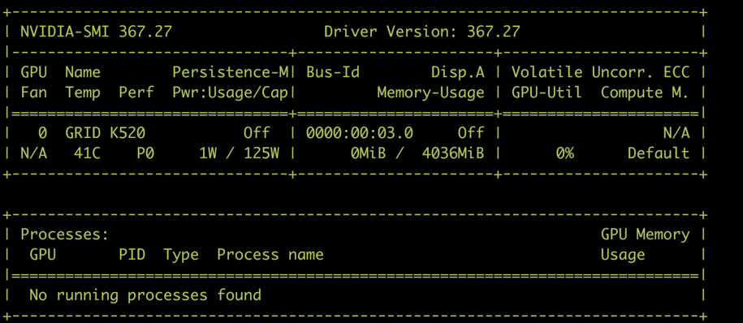

	cd /usr/local/cuda-7.5/
	cd samples
	sudo make

Let’s verify CUDA installation went well.

	cd /usr/local/cuda-7.5/samples/1_Utilities/deviceQuery
./deviceQuery

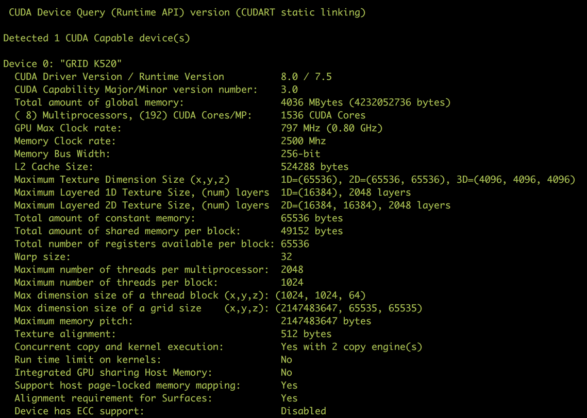

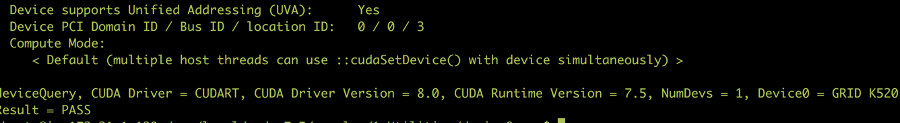

Now we’ll install CuDNN, which is the Deep Neural Network framework of Nvidia. It requires registration to Nvidia’s site at:

[https://developer.nvidia.com/rdp/cudnn-download]()

then, select as in the image and “cuDNN v5.1 Library for Linux”:

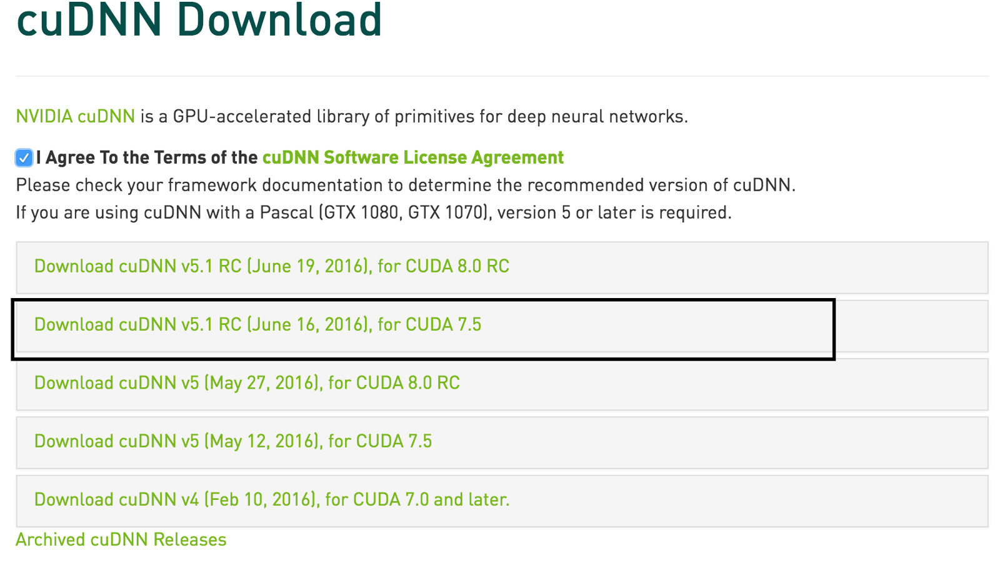

We install the latest which is an RC version (release candidate) as the previous one, had issues with (5.0.x) and V5 brings major speed improvements.

You’ll need to upload it to dropbox / google drive / other and download it from there.

We’ll use s3 [Amazon’s distributed scalable file storage] to download:

	aws s3 cp s3://my-bucket/cudnn-7.5-linux-x64-v5.1-rc.tgz .

Next we’ll extract and copy the required files

	tar xvzf cudnn-7.5-linux-x64-v5.1-rc.tgz
	sudo cp cuda/include/cudnn.h /usr/local/cuda/include
	sudo cp cuda/lib64/libcudnn* /usr/local/cuda/lib64
	sudo chmod a+r /usr/local/cuda/include/cudnn.h /usr/local/cuda/lib64/libcudnn*

After installation, verify cuDnn version

	cat /usr/local/cuda/include/cudnn.h | grep CUDNN_MAJOR -A 2

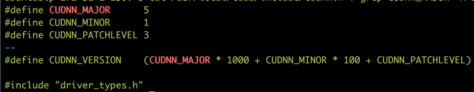

Now we need to build from source. Why?

it’s true that we could go about it using:

	# Ubuntu/Linux 64-bit, GPU enabled, Python 3.5 
	# Requires CUDA toolkit 7.5 and CuDNN v4. For other versions, see 
	"Install from sources" below. 
	$ export TF_BINARY_URL=https://storage.googleapis.com/tensorflow/linux/gpu/tensorflow-0.9.0-cp35-cp35m-linux_x86_64.whl

(taken from [https://www.tensorflow.org/versions/r0.9/get_started/os_setup.html]())

but as instructed, for other versions, such as CuDNN v5 we’ll need to build from source.

Installing open JDK

	sudo add-apt-repository -y ppa:webupd8team/java
	sudo apt-get update
	echo debconf shared/accepted-oracle-license-v1-1 select true | sudo debconf-set-selections
	echo debconf shared/accepted-oracle-license-v1-1 seen true | sudo debconf-set-selections
	sudo apt-get install -y oracle-java8-installer

The most important part…… **BAZEL**

you’d want to install v.0.2.2 , not 0.2.2b or any other newer version.

	sudo apt-get install pkg-config zip zlib1g-dev unzip
	wget https://github.com/bazelbuild/bazel/releases/download/0.2.2/bazel-0.2.2-installer-linux-x86_64.sh
	./bazel-0.2.2-installer-linux-x86_64.sh --user
	rm bazel-0.2.2-installer-linux-x86_64.sh

Now we’re going to install MiniConda and install Python 3.5.1, building and installation is going to take place in a virtual environment. We don’t want to bind any system files. In addition we’re going to use *Screen* during the process.

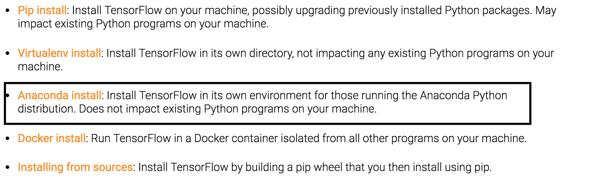

Download and install MiniConda:

	wget https://repo.continuum.io/miniconda/Miniconda3-latest-Linux-x86_64.sh
	bash Miniconda3-latest-Linux-x86_64.sh

Confirm the license agreement and the paths when asked.

After installation, let’s install Tensorflow

Install TensorFlow:

We’ll start a new screen and activate the virtual environment:

	screen -S tf_install
	source activate root
	pip install --upgrade pip
	pip install numpy

Then we’ll clone Tensorflow, TF 0.9 requires swig

	git clone --recurse-submodules https://github.com/tensorflow/tensorflow
	sudo apt-get install swig
	cd tensorflow
	./configure

you’ll be prompted with questions, answer as follows:

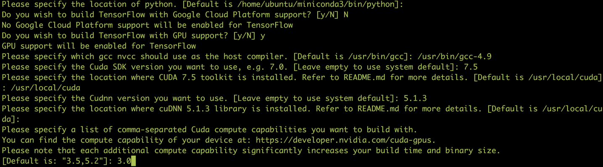

building TensorFlow:

	bazel build -c opt — config=cuda //tensorflow/cc:tutorials_example_trainer
	bazel build -c opt — config=cuda //tensorflow/tools/pip_package:build_pip_package
	bazel-bin/tensorflow/tools/pip_package/build_pip_package /tmp/tensorflow_pkg
	curl https://bootstrap.pypa.io/ez_setup.py -o — | python
	pip install — upgrade /tmp/tensorflow_pkg/*.whl

Re-run export

	export LD_LIBRARY_PATH=”$LD_LIBRARY_PATH:/usr/local/cuda/lib64"

Let’s verify that TensorFlow is installed successfully:

	python ~/tensorflow/tensorflow/models/image/mnist/convolutional.py

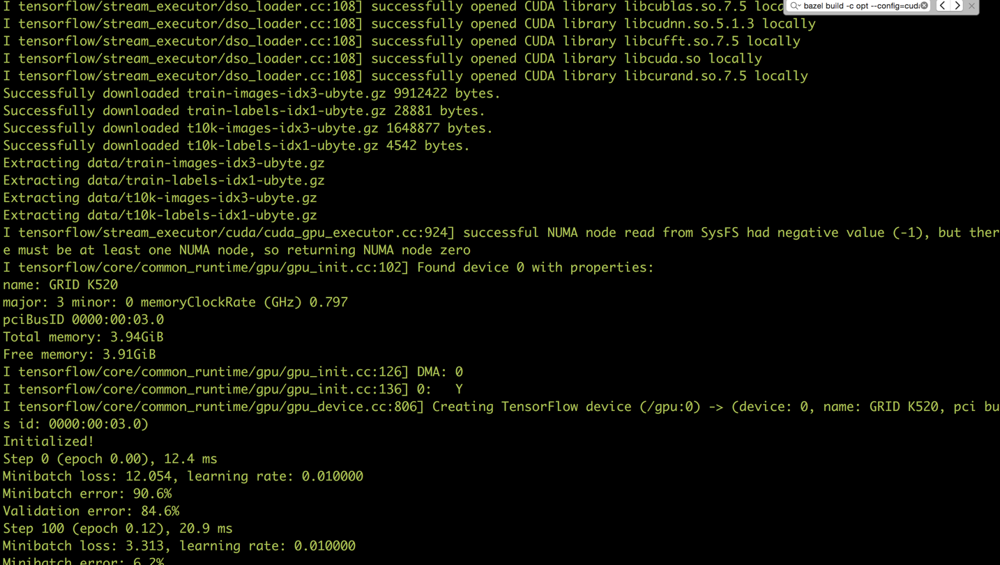

Press *cmd+alt+d* to detach from the screen.

Next step is using TensorBoard. While you train a model (or not), add TensorBoard.

	screen -S tensorboard
	tensorboard --logdir=/train/runs/

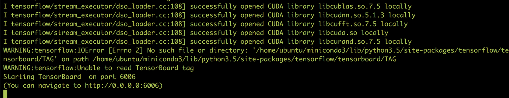

Then open your browser in http://<-instance public ip->:6006

The way it looks is as follow:

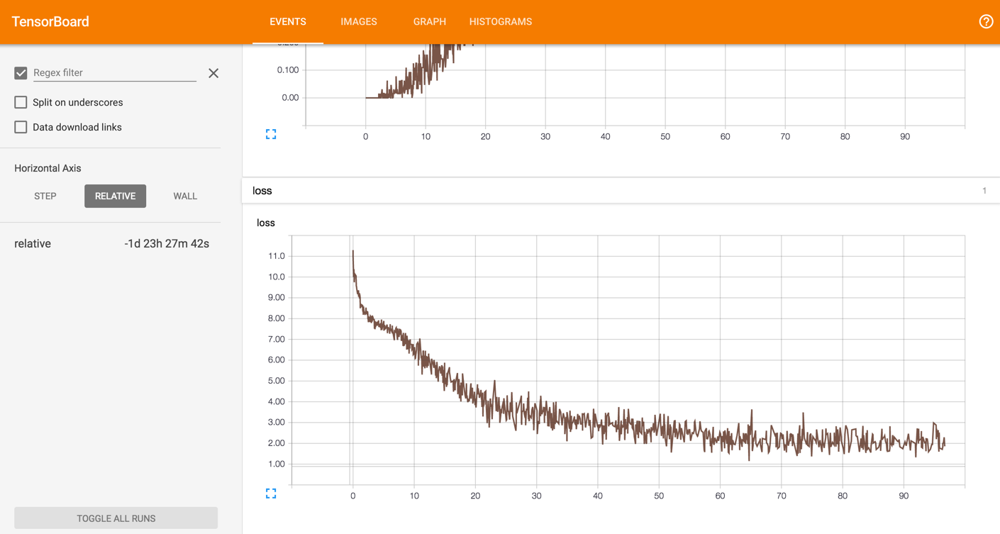

Remember that you’ll need to use the SummaryWriter to write to logs.

hit *cmd+alt+d* to get out of the screen

Next step is installing Jupyter. This is of course optional (mostly for DEV machines).

hit *cmd+alt+d* to get out of the screen

and run, make sure to specify password for the last command:

	screen -S notebooks
	source activate root
	conda install jupyter
	jupyter notebook --generate-config
	key=$(python -c "from notebook.auth import passwd; print(passwd())")

and then create login SSL certificates, ignore all the values

	cd ~
	mkdir certs
	cd certs
	certdir=$(pwd)
	openssl req -x509 -nodes -days 365 -newkey rsa:1024 -keyout mycert.key -out mycert.pem

Lastly set the configurations for Jupyter:

	cd ~
	sed -i “1 a\
	c = get_config()\\
	c.NotebookApp.certfile = u’$certdir/mycert.pem’\\
	c.NotebookApp.ip = ‘*’\\
	c.NotebookApp.open_browser = False\\
	c.NotebookApp.password = u’$key’\\
	c.NotebookApp.port = 8888” .jupyter/jupyter_notebook_config.py

and create a directory

	mkdir -p ~/notebooks
	cd ~/notebooks
	jupyter notebook --certfile=~/certs/mycert.pem --keyfile ~/certs/mycert.key

open your browser and point it to the instance’s public ip at port 8888 such as:

	https://<-instance public ip->:8888

when you’ll use your browser make sure to allow access to it:

”")

You’ll need to enter the password you’ve used above to login and then:

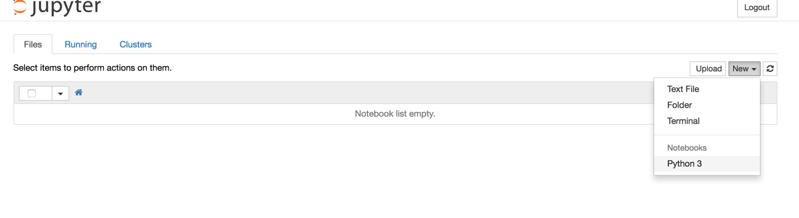

That’s it! now you have Jupyter running in a virtual environment, with Python 3.5.1

Enjoy! Create an AMI of this instance and start developing. I’ll continue this series incrementally diving more into engineering, data-science with the use of TensorFlow.

Have fun and please comment below!

USF students/ staff, please feel free contacting me.

>Gil Tamari, Director of Data Science, Wiser

[https://medium.com/@giltamari/tensorflow-getting-started-gpu-installation-on-ec2-9b9915d95d6f#.uq9ps9q9v]()

